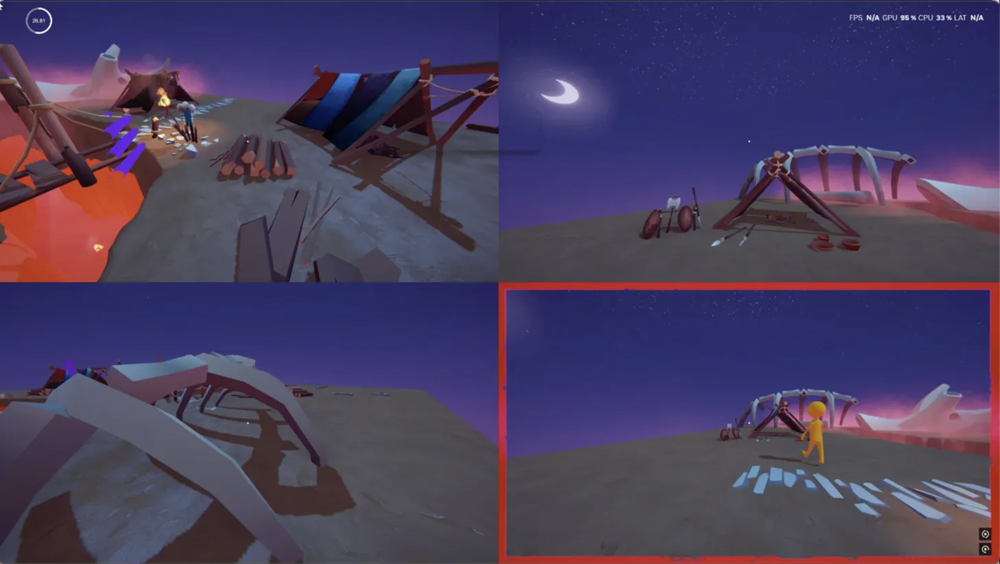

# Huddle-Up 🎮

A local multiplayer party game built in Unity featuring multiple competitive game modes where players battle for survival across various maps.

## Game Modes

### Tag (Battle Royale Style)
- **Objective**: Don't be "it" when time runs out
- **Rounds**: 60-second elimination rounds
- **Mechanics**: Tag transfers between players, last person tagged when timer hits zero is eliminated
- **Victory**: Be the last player standing

*Additional game modes coming soon*

## Features

- **Local Multiplayer**: Up to 4 players using gamepads/keyboard
- **Elimination-based Rounds**: Fast-paced 60-second rounds with instant eliminations
- **Multiple Maps**: Playground, Camp, and Village environments
- **Player Customization**: Choose your character color
- **Spectator Mode**: Eliminated players can watch remaining rounds
- **Pause System**: Any player can pause the game

## Game Flow (Tag Mode)

1. **Lobby**: Players join and select colors
2. **Map Selection**: Choose from available maps
3. **Round Start**: Random player becomes "it" (turns red)
4. **60-Second Round**: Players try to tag others to pass the "it" status
5. **Elimination**: Player who is "it" when timer ends is eliminated
6. **Next Round**: Remaining players start new round with random "it"
7. **Victory**: Last player standing wins

## Architecture

- **Modular Game Modes**: Extensible system for adding new game modes
- **GameControl**: Manages game state, round progression, and elimination
- **Player Systems**: Movement, interaction, and visual feedback
- **Input System**: Modern Unity input handling for multiple devices
- **Timer System**: Handles countdown timers and elimination logic

Built with Unity's recommended patterns including ScriptableObjects for configuration, events for decoupling, and proper component separation to support multiple game modes.

## Look Inside
 
 
 
 
